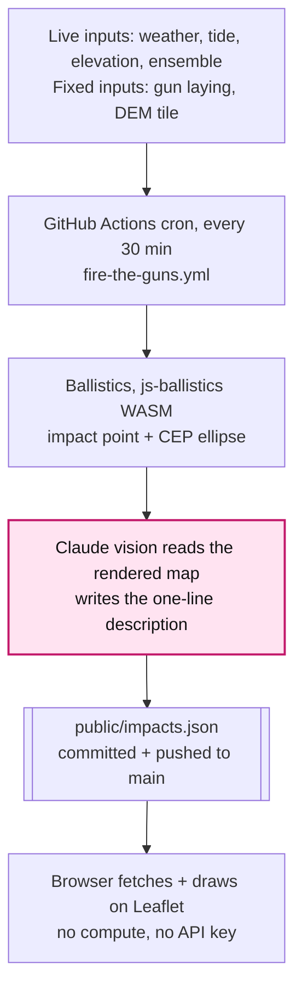
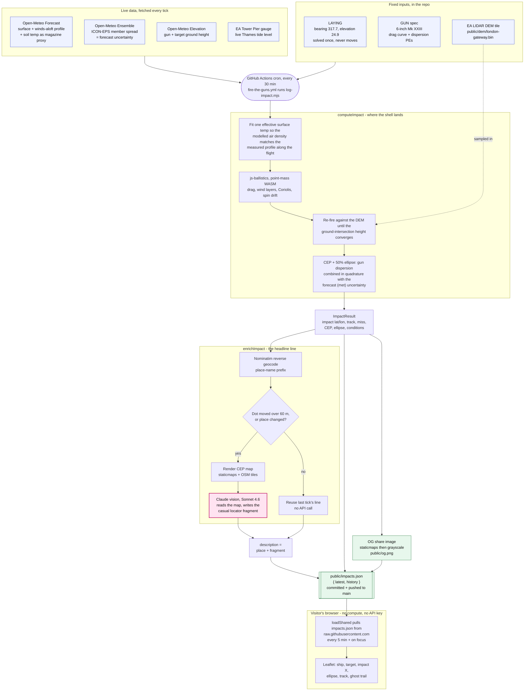

# Where Would HMS Belfast Hit Right Now?

[](https://github.com/SilentKinfolk/where-would-hms-belfast-hit/actions/workflows/ci.yml)
[](https://github.com/SilentKinfolk/where-would-hms-belfast-hit/actions/workflows/deploy.yml)

**Live site:** <https://wherewouldhmsbelfasthit.com>

A ballistic calculator for the 6-inch guns of
[HMS Belfast](https://en.wikipedia.org/wiki/HMS_Belfast), the WWII cruiser moored
in the Pool of London. The forward turrets have pointed at the **London Gateway
services** on the M1 since 1971. This app simulates where a shell fired from
that fixed laying would land in today's weather.

|  |  |
|---|---|
| Firing origin | HMS Belfast forward turrets — 51.50676°N, 0.08219°W |
| Target        | London Gateway services — 51.63107°N, 0.26473°W |
| Range/bearing | ~18.69 km on bearing ~318° |
| Gun           | BL 6"/50 Mk XXIII — 112 lb shell, ~841 m/s, 23.3 km max range |

## Run it

```bash
npm install
npm run dev      # http://localhost:5173
npm run build    # static bundle in dist/
```

Static site: vanilla JS, [Vite](https://vitejs.dev/),
[Leaflet](https://leafletjs.com/). The exterior-ballistics engine,
[js-ballistics](https://github.com/o-murphy/js-ballistics) (C++ compiled to
WebAssembly), runs in the 30-minute cron — not the browser. Visitors only fetch
the pre-computed `public/impacts.json`; see [How it works](#how-it-works) below.

## How it works

Nothing is computed in the visitor's browser. A GitHub Actions cron fires the
fixed gun laying through live weather every 30 minutes, runs the ballistics and
the Claude vision describer server-side, and bakes the result into
`public/impacts.json`. The page just fetches that file.



Pink = the Claude vision call. Expand for the full, stage-by-stage version:

<details>
<summary>Full pipeline — every stage</summary>



Blue = live data sources · pink = the Claude vision call · green = the published
artifacts the browser reads.

</details>

## AI impact descriptions

The headline line (*"Mill Hill Golf Course, somewhere around the 15th hole."*)
is written by a Claude vision model reading the rendered impact map. It runs
once per 30-minute cron tick on GitHub Actions and is baked into
`public/impacts.json`, so visitors never trigger an API call and the key
never reaches the browser.

For local prompt iteration the same call is wrapped in a small Node proxy:

```bash
ANTHROPIC_API_KEY=sk-ant-... npm run proxy   # :8787
npm run dev                                  # Vite forwards /api/* to it
```

See [TODO.md](TODO.md) for open questions and remaining work.

## What's still estimated

This models a single shell, not a salvo: where one shell would land, with the
ellipse showing how uncertain that single point is. Two inputs would move it from
a grounded estimate to something validated, and both need real-world data:

- **The real gun laying.** Bearing (~318°) and elevation (~24.9°) come from
  satellite imagery, solved to hit the target under standard air, not measured
  from the ship. Elevation is the sensitive one: the impact moves ~340 m per
  degree, so a true "as it sits" answer needs the barrel angle and bearing read
  off the mounting at the museum.
- **A real range table.** Drag, drift and round-to-round dispersion are fitted or
  estimated. An RN range table for the 6"/50 Mk XXIII (BR.224 at TNA Kew or the
  IWM library) would give measured drift and dispersion to replace them.

## Credits

- Gun & range tables: [NavWeaps](http://www.navweaps.com/Weapons/WNBR_6-50_mk23.php)
- Ballistics engine: [js-ballistics](https://github.com/o-murphy/js-ballistics)
- Weather, tide & elevations: [Open-Meteo](https://open-meteo.com/),
  [Environment Agency](https://environment.data.gov.uk/flood-monitoring/doc/reference)
- Maps & place names: [OpenStreetMap](https://www.openstreetmap.org/copyright)

Educational toy. Uses many approximations, not a real fire-control solution.
